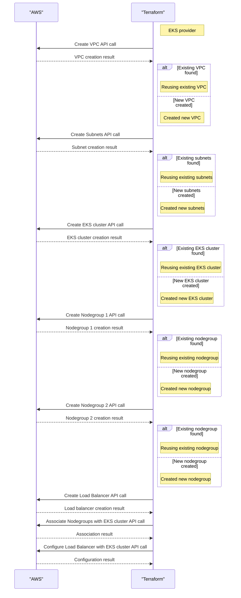

# SnackHub.Terraform
This repository holds the code to create the infrastructure at EKS by using terraform


This repository holds the Terraform configuration to deploy an [EKS](https://docs.aws.amazon.com/eks/latest/userguide/what-is-eks.html) Cluster, with its [Node Groups](https://docs.aws.amazon.com/eks/latest/userguide/managed-node-groups.html) and [VPC](https://docs.aws.amazon.com/eks/latest/userguide/network-reqs.html) <br>

Basically this repository is used to provide AWS EKS infrastructure as code that will be consumed by [SnackHub](https://github.com/Team-One-Pos-Tech/SnackHub) project when deployed at AWS or any other cloud provider by using [Kubernetes](https://kubernetes.io/docs/concepts/overview/).

This project is intended to be executed by an automated CI project, however it can be used by a developer or any techincal person at its local environment, this second one need to have some setup first. It will be described later at this documentation.

## How it Works

The Terraform code at this repository uses the `AWS` provider to interact with AWS EKS, VPC and NodeGroups.

Here's a high-level overview of the deployment process:




## How to use it


### Local Execution - Using AWS Academy Credentials

To make it possible to execute the code at this repository, please, make sure you:
    - Have install Terraform ([version 1.9.6](https://github.com/hashicorp/terraform/releases/tag/v1.9.6) or [later](https://github.com/hashicorp/terraform/releases)) on your machine.
    - You have [AWS CLI](https://aws.amazon.com/cli/) install at your machine
    - You have started the AWS Academy laboratory and waits it to start. _I will have a small green icon into a button/link at the tio of the page with AWS written on it_.
    - You had setup the Lab credentials at you machine by getting it at the *Cloud Access panel* at the right side of the screen, clicked over the gray button with Show at side of AWS CLI and following the insctructions it describes:
    `Copy and paste the following into ~/.aws/credentials`


With that done, you have all necessary data to execute the terraform commands to create the database cluster. <br>


#### Executing terraform commands
Now you can execute Terraform commands at the root folder of this project.
Lets download all modules and dependencies by executing at you terminal:

```sh
terraform init
```

When completed, lets plan our implementation. Here, we are going to pass some variable to the command. It will be similar to:

```sh
terraform plan -out eks.tfstate
```

If the result is positive, now it's time to apply those changes at the the Atlas Servers.
The execution will be something like:

```sh
terraform apply -auto-approve eks.tfstate
```

When the process completes, you should have a working EKS cluster that will be able to configure your kubectl config.
In order to that, you will need to execute an AWS ClI command like this:


```sh
aws eks --region us-east-1 update-kubeconfig --name snack-hub-cluster
```

With that done, you should be able to execute [kubectl commands](https://kubernetes.io/docs/reference/kubectl/) at this cluster.

To validate that, you can execute: 
```sh
kubectl get pods
```

#### Deleting the Cluster

if you with/need to delete the cluster. just execute the command:

```sh
terraform destroy
```


### Github Actions - Automated CI

At this moment, it will be excecuted everytime this project receives a merge, thouught a Pull Request to the main branch, so the cluster and all infrastructrure will be deleted and created again!

It will have improvements at the future.
